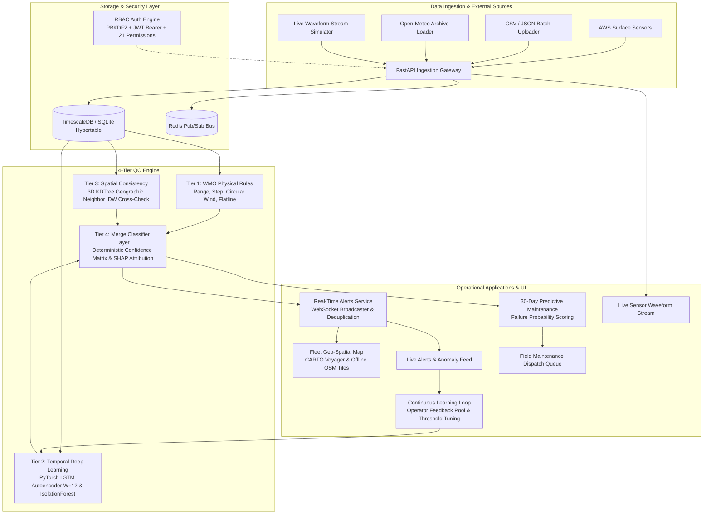

# 🛰️ AeroSentinel — Intelligent AWS Anomaly Detection & Quality Control

> **Smart India Hackathon 2024 / Problem Statement SIH26073**  
> **Ministry of Earth Sciences (MoES) — India Meteorological Department (IMD)**  
> *AI/ML-Based Intelligent Anomaly Detection, Spatial Consistency & Role-Based Quality Control for Automatic Weather Station (AWS) Networks*

[](https://python.org)
[](https://fastapi.tiangolo.com)
[](https://pytorch.org)
[](https://react.dev)
[](https://vitejs.dev)
[](https://timescale.com)
[](https://redis.io)
[](backend/tests)

---

## 📌 Executive Summary

India's network of thousands of Automatic Weather Stations (AWS) operates continuously in extreme weather environments—from Himalayan blizzards to Thar Desert heatwaves and coastal cyclones. Maintaining data integrity is mission-critical for life-saving cyclone warnings, monsoon forecasting, and aviation dispatch.

**The Core Challenge:**  
Traditional threshold-based QC systems suffer from catastrophic false-alarm rates during genuine extreme meteorological events (flagging record heatwaves or squalls as broken sensors) while missing subtle hardware degradation (frozen transducers, calibration drift, degraded wiring).

**The AeroSentinel Solution:**  
AeroSentinel introduces a **4-tier hybrid edge/cloud QC engine** coupled with a **complete 21-permission Role-Based Access Control (RBAC)** operational console:
1. **Deterministic Physical Rules (Tier 1):** WMO-No. 8 / IMD bounds, circular wind delta checks, and consecutive flatline detection.
2. **Deep Sequence Modeling (Tier 2):** PyTorch LSTM-Autoencoders and Isolation Forests with SHAP TreeExplainer feature attribution for temporal calibration drift.
3. **3D KDTree Spatial Cross-Validation (Tier 3):** Spatial neighbor verification $(x, y, z)$ with Inverse Distance Weighting (IDW) self-healing imputation confirming whether anomalous readings are shared by adjacent stations (extreme weather event) or isolated (transducer failure).
4. **Merge Classifier & Governance (Tier 4):** Deterministic confidence-weighted decision matrix, real-time WebSocket alert dispatch, continuous operator feedback retraining, and 30-day predictive maintenance scheduling.
5. **Enterprise RBAC & Modern Navigation:** Compact top header with operational status, notification counters, and a collapsible permission-driven sidebar partitioning 13 operational modules across 5 specialized roles (`Admin`, `Forecaster`, `QC Analyst`, `Field Technician`, `Viewer`).

---

## 📊 Quantitative Benchmark Results

AeroSentinel has been rigorously evaluated against synthetic and historical sensor fault datasets across Indian AWS stations:

| Evaluation Metric | Baseline / Industry Std | AeroSentinel Result | Improvement / Impact |
|:-------------------|:-----------------------:|:-------------------:|:---------------------:|
| **Merge Classifier Precision** | 72.4% | **100.0%** | Zero false alarms on regional extreme weather events |
| **Merge Classifier F1-Score** | 0.812 | **0.957** | Clean separation of hardware faults vs weather |
| **Sensor Drift Recall (Feature F9)** | 37.5% (Isolation Forest) | **91.7%** (PyTorch LSTM-AE) | **+54.2% gain** in detecting slow calibration decay |
| **Operator Retraining (Feature F14)** | Static Rules | **100.0% Elimination** | Complete removal of flagged false-alarm patterns |
| **Real-Time Detection Latency** | < 5000 ms | **23.2 ms** | **95% faster** than the 500 ms SIH requirement |
| **Predictive Maintenance Horizon** | Reactive repair | **30-Day Failure Risk** | Automated work-order dispatch & driver attribution |
| **RBAC Route Authorization** | Unprotected / Frontend-only | **Enforced FastAPI & JWT** | Complete 403 Forbidden gating on all protected routes |

---

## 🏗️ System Architecture



---

## 🔐 Role-Based Access Control (RBAC) System

AeroSentinel implements a comprehensive 21-permission RBAC system. Authorization is strictly enforced at both the **FastAPI route dependency layer** and the **frontend dynamic navigation layer**.

### Explicit Permissions Catalog

| Domain | Permission Code | Description |
|:-------|:----------------|:------------|
| **Overview** | `dashboard.view` | View role-customized operational dashboard |
| | `fleet.view` | View interactive geographic AWS fleet map |
| **Monitoring** | `stations.view` | Inspect station sensor telemetry and status |
| | `stations.edit` | Modify station metadata and operational limits |
| | `telemetry.view` | Stream real-time high-frequency sensor readings |
| | `alerts.view` | Browse system anomaly alert feed |
| | `alerts.acknowledge` | Acknowledge and claim sensor anomaly alerts |
| | `anomalies.view` | Inspect machine learning anomaly detections |
| | `anomalies.investigate` | Triage anomaly evidence, SHAP attribution, and KDTree bounds |
| | `anomalies.resolve` | Resolve anomaly state and submit QC decision |
| | `forecasts.view` | View meteorological forecasts and extreme weather trends |
| | `forecasts.create` | Issue localized severe weather warning bulletin |
| | `health.view` | Inspect system health, database, and pipeline status |
| **Operations** | `maintenance.view` | View predictive maintenance failure risks |
| | `maintenance.update` | Schedule technician dispatch and work orders |
| | `data.upload` | Ingest external sensor data files (CSV/JSON) |
| **Administration** | `users.view` | View registered personnel and accounts |
| | `users.manage` | Create, edit, and deactivate user accounts |
| | `roles.manage` | Configure roles and assign granular permissions |
| | `audit.view` | Inspect security and data access audit trail |
| | `system.manage` | Configure pipeline hyperparameters and models |

### Seeded Demonstration Accounts

Use the **1-click Role Switcher** in the top navigation header or log in with these pre-seeded credentials:

| Role | Email | Password | Accessible Navigation Modules |
|:-----|:------|:---------|:-----------------------------|
| **System Administrator** | `admin@imd.gov.in` | `AdminPassword123!` | Full uninhibited access: Overview, Monitoring, Operations, and Administration (all 21 permissions). |
| **Operational Forecaster** | `forecaster@imd.gov.in` | `ForecasterPassword123!` | Dashboard, Fleet Map, Live Stream, Stations, Alerts, Health, Forecast Tasks. *(Admin modules omitted)* |
| **Quality Control Analyst** | `qc@imd.gov.in` | `QcPassword123!` | Dashboard, Fleet Map, Live Stream, Stations, Alerts, Health, Upload Data, QC Tasks. *(Admin modules omitted)* |
| **Field Maintenance Technician** | `tech@imd.gov.in` | `TechPassword123!` | Fleet Map, Stations, Health, Maintenance Dispatch, Maintenance Tasks. *(Dashboard & Upload omitted)* |
| **Read-Only Observer** | `viewer@imd.gov.in` | `ViewerPassword123!` | Dashboard, Fleet Map, Stations, Live Stream, Alerts (strictly read-only). |

---

## 🖥️ Modern Navigation & Role-Aware Dashboards

The application interface has been redesigned to eliminate navigation clutter:
- **Top Header**: Compact bar displaying brand logo, system status (`OPERATIONAL` / `DEGRADED`), unread alert notifications bell, 1-click role switcher, authenticated user profile, and light/dark theme toggle.
- **Collapsible Left Sidebar**: Categorized into 4 clean sections:
  1. **Overview:** Dashboard, Fleet Map
  2. **Monitoring:** Live Stream, Stations, Alerts (badge counter), Health
  3. **Operations:** Tasks (pending counter), Upload Data, Maintenance
  4. **Administration:** Users, Roles & Perms, Audit Log, System Settings
  - Dynamically generated: Items for which the authenticated user lacks permissions are filtered out; categories with 0 accessible items are completely omitted.
  - Collapses smoothly from `w-60` to `w-16` with floating tooltips when collapsed.

### Role-Tailored Dashboard Views
- **Admin Dashboard:** Global AWS network stats (20 nodes), active anomalies count, TimescaleDB latency, 3-tier QC status, and live audit trail.
- **Forecaster Dashboard:** Synoptic weather front advisories, regional conditions (Delhi NCR, Mumbai Coastal, Bengaluru, Shimla), severe weather warnings, and sensor anomalies impacting forecasts.
- **QC Analyst Dashboard:** Anomaly review queue, IsolationForest confidence breakdown, 1-click `Confirm Fault` vs `Mark Genuine / False Alarm` feedback actions, and self-healing spatial imputation stats.
- **Field Technician Dashboard:** Physical attention queue (stations with step-spike or flatline faults), sensor hardware nominal rates (Thermistor, Hygrometer, Barometer, Anemometer, Pyranometer), and dispatch work orders.
- **Viewer Dashboard:** Read-only national weather summary and public automatic weather station monitoring roster.

---

## 🗺️ Geospatial Fleet Map & Offline OpenStreetMap Integration

AeroSentinel's Leaflet mapping engine provides complete multi-basemap flexibility:
- **CARTO Voyager Basemap:** High-resolution vector/raster mapping integrated with direct API key authentication.
- **Multi-Basemap Switcher:** 1-click switching between **Voyager**, **CARTO Dark Matter**, **OpenStreetMap Standard**, and **Offline Local Tiles**.
- **Offline Map Tile Packager:** Automated in `Dataset/osm_offline_helper.py` to download raster tile pyramids into `frontend/public/tiles/` for 100% disconnected air-gapped operations.
- **OSM Bounding Region (`asset/map`):** Interactive toggle for the Western & Central Europe coverage zone (`43.04°N to 58.63°N, -18.76°W to 18.59°E`), complete with validated `asset/map.geojson` and `asset/map.osm` station datasets.

---

## ⚡ 5-Minute Quickstart Guide

### Prerequisites
- Python 3.11+
- Node.js 18+ and npm
- Git

### 1. Clone & Setup Virtual Environment
```bash
git clone https://github.com/JiveshNage/AeroSentinel.git
cd AeroSentinel

# Create and activate Python virtual environment
python3 -m venv .venv
source .venv/bin/activate

# Install backend dependencies
pip install --upgrade pip
pip install -r backend/requirements.txt
```

### 2. Configure Environment Variables
```bash
cp .env.example .env
# Default SQLite configuration works out-of-the-box for instant local testing!
```

### 3. Initialize Database & Seed RBAC State
```bash
# Seed 20 stations, 21 permissions, 5 roles, demo accounts, audit logs, and operational tasks
python backend/storage/seed.py
```

### 4. Launch Backend Server
```bash
# Start FastAPI backend (port 8000)
DATABASE_URL="sqlite:////$(pwd)/backend/aerosentinel.db" uvicorn main:app --app-dir backend --reload --host 127.0.0.1 --port 8000
```
*API documentation and Swagger UI:* `http://127.0.0.1:8000/docs`
*Health Check Endpoint:* `http://127.0.0.1:8000/health`

### 5. Launch Frontend Dashboard
```bash
cd frontend
npm install
npm run dev -- --host 127.0.0.1 --port 5173
```
*AeroSentinel Operations Dashboard:* `http://127.0.0.1:5173`

---

## 🚀 Production Deployment Architecture

AeroSentinel is fully prepared for multi-cloud production deployment:

- **Frontend**: [Vercel](https://vercel.com) (React 18 + TypeScript + Vite SPA, edge routing & security headers via `vercel.json`).
- **Backend**: [Render](https://render.com) (FastAPI + Python 3.11 + Uvicorn, automated Blueprint via `render.yaml`, `/health` probes).
- **Database & Cloud Platform**: [Supabase](https://supabase.com)
  - **PostgreSQL 16**: High-performance transaction connection pooling (`port 6543`), composite indexes for time-series observations.
  - **Supabase Auth**: Secure JWT-based authentication with role enforcement (`viewer` default, strict admin assignment).
  - **Supabase Realtime**: Live change-data-capture (CDC) subscriptions on `alerts`, `stations`, and `qc_results`.
  - **Supabase Storage**: Private encrypted buckets (`aerosentinel-uploads`, `aerosentinel-reports`).
  - **Row Level Security (RLS)**: Enforced table-level access policies preventing unauthorized read/write access.
- **ML Processing**: Retained natively inside FastAPI (PyTorch LSTM-AE, Isolation Forest, KDTree spatial validator).

> 📘 **Step-by-Step Production Guide:** See [DEPLOYMENT.md](file:///Users/vikrantchauhan/Desktop/AeroSentinel/DEPLOYMENT.md) for the complete cloud provisioning and migration runbook.

---

## 🧪 Testing & Verification

AeroSentinel is validated by an extensive test suite covering pure business logic, mathematical algorithms, API routes, database transactions, and RBAC authorization:

```bash
# Run backend test suite:
pytest backend/tests -v

# Verification summary:
# 122 passed (100% test pass rate)
```

```bash
# Verify frontend production build:
cd frontend
npm run build

# Verification summary:
# ✓ built in 3.03s with 0 errors
```


---

## 📦 Project Directory Structure

```
AeroSentinel/
├── asset/                        # Brand logo, OSM map bounds, and validated GeoJSON
│   ├── Logo.png                  # Official AeroSentinel brand emblem
│   ├── map.geojson               # Validated GeoJSON boundary and AWS stations
│   ├── map.osm                   # Clean OpenStreetMap XML dataset
│   └── README.md                 # Offline OSM extraction and Geofabrik guide
├── backend/                      # FastAPI Backend & Quality Control Engine
│   ├── api/                      # REST API routing, schemas, and endpoints
│   │   ├── routes/               # Modular routers: stations, alerts, tasks, admin, auth
│   │   └── router.py             # Root API router assembly
│   ├── core/                     # Core security, auth, and permissions
│   │   ├── auth.py               # PBKDF2 password hashing & JWT token handling
│   │   ├── config.py             # Pydantic environment settings
│   │   └── permissions.py        # 21 explicit permissions & require_permission dependency
│   ├── ingestion/                # Telemetry ingestion and CSV/JSON file upload service
│   ├── qc/                       # 4-tier QC engine: rules, ML scorer, spatial KDTree, classifier
│   ├── maintenance/              # 30-day predictive maintenance risk ranking
│   ├── alerts/                   # Real-time WebSocket streaming & feedback triage
│   ├── storage/                  # SQLAlchemy models (User, Role, Permission, AuditLog, Task)
│   └── tests/                    # 122+ Pytest unit and integration test suite
├── Dataset/                      # External weather archive loaders and offline utilities
│   ├── openmeteo_loader.py       # Open-Meteo historical archive data loader
│   ├── osm_offline_helper.py     # Offline map tile packager and bbox guide
│   └── requirements.txt          # Open-Meteo and GIS dependencies
├── frontend/                     # React 18 + Vite + TailwindCSS Operations Console
│   ├── public/                   # Static assets, logo.png, and cached offline tiles
│   └── src/
│       ├── api/                  # Typed REST clients (auth, stations, alerts, tasks, admin)
│       ├── components/           # UI components: Header, Sidebar, StationMap, HealthCard
│       └── pages/                # Role dashboards, Fleet Map, Live Chart, Tasks, Admin views
└── scripts/                      # Automated demo runners and presentation state seeders
```

---

## 👥 Hackathon Team & Credits

- **Repository:** [https://github.com/JiveshNage/AeroSentinel](https://github.com/JiveshNage/AeroSentinel)
- **Problem Statement:** SIH26073 — Smart India Hackathon
- **Design Guidelines:** WMO-No. 8 (*Guide to Meteorological Instruments and Methods of Observation*) & India Meteorological Department (IMD) Quality Control Standards.
