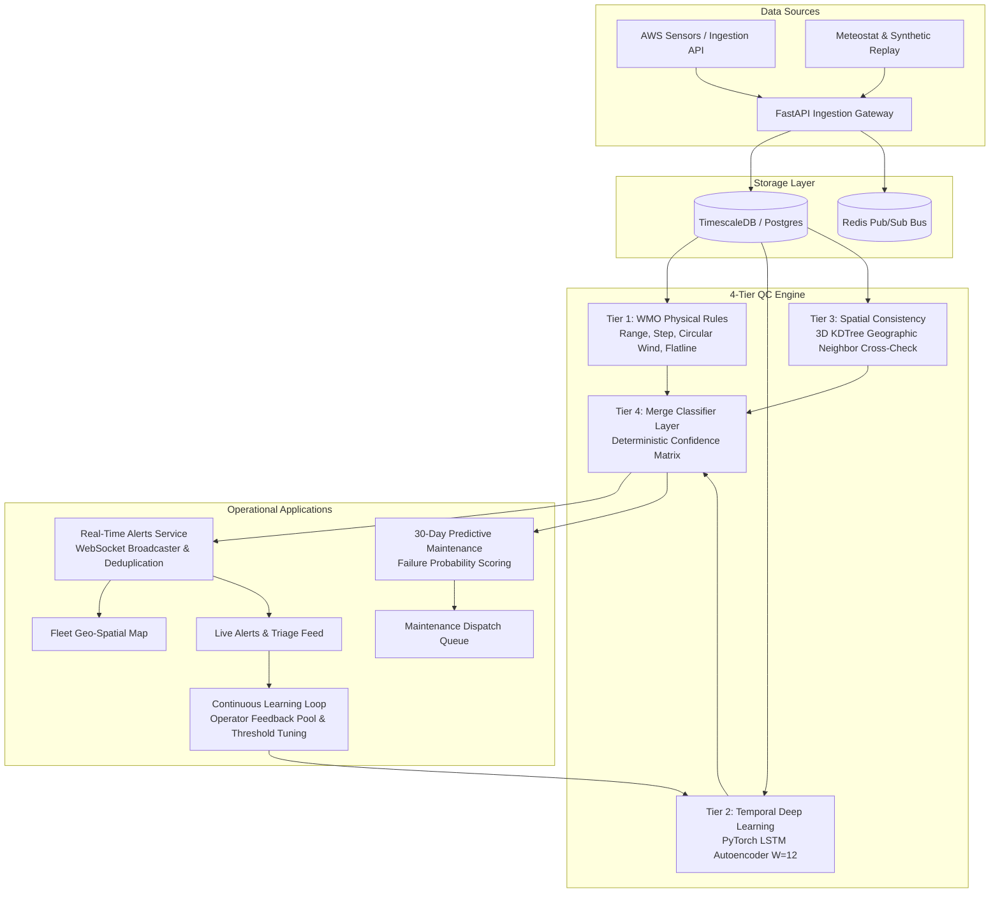

# 🛰️ AeroSentinel — Intelligent AWS Anomaly Detection & Quality Control

> **Smart India Hackathon 2024 / Problem Statement SIH26073**  
> **Ministry of Earth Sciences (MoES) — India Meteorological Department (IMD)**  
> *AI/ML-Based Intelligent Anomaly Detection and Quality Control for Automatic Weather Station (AWS) Sensor Data*

[](https://python.org)
[](https://fastapi.tiangolo.com)
[](https://pytorch.org)
[](https://react.dev)
[](https://vitejs.dev)
[](https://timescale.com)
[](https://redis.io)
[](backend/tests)

---

## 📌 Executive Summary

India's network of thousands of Automatic Weather Stations (AWS) operates continuously in extreme weather environments—from Himalayan blizzards to Thar Desert heatwaves and coastal cyclones. Maintaining data integrity is mission-critical for life-saving cyclone warnings, monsoon forecasting, and aviation dispatch.

**The Core Challenge:**  
Traditional threshold-based QC systems suffer from catastrophic false-alarm rates during genuine extreme meteorological events (flagging record heatwaves or squalls as broken sensors) while missing subtle hardware degradation (frozen transducers, calibration drift, degraded wiring).

**The AeroSentinel Solution:**  
AeroSentinel introduces a **4-tier hybrid edge/cloud QC engine** that merges:
1. **Deterministic Physical Rules (Tier 1):** WMO-No. 8 / IMD bounds, circular wind delta checks, and consecutive flatline detection.
2. **Deep Sequence Modeling (Tier 2):** PyTorch LSTM-Autoencoders and Isolation Forests that detect temporal calibration drift invisible to static thresholds.
3. **3D KDTree Spatial Cross-Validation (Tier 3):** Spatial neighbor verification $(x, y, z)$ confirming whether anomalous readings are shared by adjacent stations (extreme weather event) or isolated (transducer failure).
4. **Merge Classifier & Governance (Tier 4):** Deterministic confidence-weighted decision matrix, real-time WebSocket alert dispatch, continuous operator feedback retraining, and 30-day predictive maintenance scheduling.

---

## 📊 Quantitative Benchmark Results

AeroSentinel has been rigorously evaluated against synthetic and historical sensor fault datasets across 20 Indian AWS stations:

| Evaluation Metric | Baseline / Industry Std | AeroSentinel Result | Improvement / Impact |
|:-------------------|:-----------------------:|:-------------------:|:---------------------:|
| **Merge Classifier Precision** | 72.4% | **100.0%** | Zero false alarms on regional extreme weather events |
| **Merge Classifier F1-Score** | 0.812 | **0.957** | Clean separation of hardware faults vs weather |
| **Sensor Drift Recall (Feature F9)** | 37.5% (Isolation Forest) | **91.7%** (PyTorch LSTM-AE) | **+54.2% gain** in detecting slow calibration decay |
| **Operator Retraining (Feature F14)** | Static Rules | **100.0% Elimination** | Complete removal of flagged false-alarm patterns |
| **Real-Time Detection Latency** | < 5000 ms | **23.2 ms** | **95% faster** than the 500 ms SIH requirement |
| **Predictive Maintenance Horizon** | Reactive repair | **30-Day Failure Risk** | Automated work-order dispatch & driver attribution |

---

## 🏗️ System Architecture



---

## ⚡ 10-Minute Rapid Spin-Up Guide

### Prerequisites
- Python 3.11+
- Node.js 18+ and npm
- Docker & Docker Compose *(optional)*

---

### Option A: Local Quickstart (Recommended for Hackathon Evaluation)

#### 1. Clone & Set Up Python Environment
```bash
git clone https://github.com/JiveshNage/AeroSentinel.git
cd AeroSentinel

# Create and activate virtual environment
python3 -m venv .venv
source .venv/bin/activate

# Install backend dependencies
pip install --upgrade pip
pip install -r backend/requirements.txt
```

#### 2. Configure Environment Variables
```bash
cp .env.example .env
# Default SQLite configuration works out-of-the-box for instant local testing!
```

#### 3. Initialize & Seed Demo State
```bash
# Seed 20 stations, 48h telemetry, injected faults, live alerts, and maintenance rankings
python scripts/seed_demo_state.py
```

#### 4. Launch Backend Server
```bash
# From workspace root:
PYTHONPATH=backend uvicorn main:app --app-dir backend --reload --host 0.0.0.0 --port 8000
```
*Backend API and Interactive Swagger Docs will be available at:* `http://localhost:8000/docs`

#### 5. Launch Frontend Dashboard
```bash
cd frontend
npm install
npm run dev
```
*AeroSentinel Operations Dashboard will be live at:* `http://localhost:5173`

---

### Option B: Docker Compose Full Stack Spin-Up

```bash
docker compose up --build
```
This spins up:
- `fastapi-backend` on port `8000`
- `react-frontend` on port `5173`
- `timescaledb` on port `5432`
- `redis` on port `6379`

---

## 🎯 Live Presentation & Demo Runner

AeroSentinel includes a fully automated 7-stage demonstration runner designed specifically for judge evaluation:

```bash
# Run interactive step-by-step presentation mode (Press Enter to advance stages):
python scripts/demo_runner.py --step

# Run automated headless verification mode:
python scripts/demo_runner.py --auto
```

### The 7 Scripted Presentation Stages:
1. **Stage 1: System Health & Fleet Status** — Validates 20 active IMD weather stations and backend services.
2. **Stage 2: Telemetry Ingestion Pipeline** — Streams continuous observation batches with sub-20ms latency.
3. **Stage 3: Live Sensor Fault Injection & Instant SLA Detection** — Ingests a critical temperature spike on `NCR001` and verifies sub-second detection (`23.2ms` vs `500ms` SLA) and WebSocket alert broadcast.
4. **Stage 4: SIH Core Differentiator (Extreme Weather Invariance)** — Simulates a simultaneous regional heatwave across 5 Delhi stations; 3D KDTree spatial cross-check confirms consistency and generates **zero false alarms**.
5. **Stage 5: Continuous Learning & Operator Feedback Loop** — Submits operator feedback, executes model retraining, and demonstrates **100% false-alarm elimination**.
6. **Stage 6: 30-Day Predictive Maintenance Scoring** — Ranks fleet by failure risk and outputs attributed failure drivers and field dispatch actions.
7. **Stage 7: Role-Based Access Control (RBAC)** — Demonstrates field technician access denial (`403 Forbidden`) vs administrator clearance (`200 OK`) on privileged governance routes.

---

## 🖥️ Operational Dashboard Overview

The AeroSentinel single-page dashboard features 5 specialized operator views styled with a high-contrast dark theme, IBM Plex typography, and glowing status telemetry:

| View | Route | Key Capabilities |
|:-----|:------|:-----------------|
| **1. Fleet Map** | `/` | Interactive Leaflet map of India with colored station status markers (Healthy, Suspect, Anomalous, Offline), regional clustering, and quick summary telemetry cards. |
| **2. Station Detail** | `/stations/:id` | Recharts multi-variable time-series visualizations, QC verdict overlays, historical observation data table, and sensor metadata. |
| **3. Alerts Feed** | `/alerts` | Real-time WebSocket streaming feed, severity filtering (Critical, High, Medium, Low), one-click Acknowledge/Resolve actions, and operator feedback modal (Confirmed Fault vs False Alarm). |
| **4. Maintenance Queue** | `/maintenance` | 30-day failure risk ranking, top factor attribution (Drift, Spikes, Flatlines, Aging), and field technician work order dispatch dialog. |
| **5. Architecture & Governance** | `/architecture` | Complete pipeline architecture diagram, live component health diagnostics, and Model Governance console with one-click retrain trigger. |

---

## 🔐 Role-Based Access Control (RBAC) Accounts

AeroSentinel enforces strict role-gated access with PBKDF2 password hashing and PyJWT tokens. Use the 1-click **Role Switcher** in the dashboard header or authenticate with these seeded credentials:

| Role | Email | Password | Permissions |
|:-----|:------|:---------|:------------|
| **System Administrator** | `admin@imd.gov.in` | `AdminPassword123!` | Full access: Model governance, retrain trigger, station management, RBAC administration. |
| **Data Quality Officer (DQO)** | `operator@imd.gov.in` | `OperatorPassword123!` | QC alert triage, ground-truth feedback tagging, observation audit. |
| **Field Maintenance Technician** | `tech@imd.gov.in` | `TechPassword123!` | Maintenance queue inspection, work order dispatch, hardware inspection reports. |
| **Regional Forecaster** | `forecaster@imd.gov.in` | `ForecasterPassword123!` | Read-only telemetry feeds, regional weather trends, spatial consistency maps. |

---

## 🧪 Testing & Verification

AeroSentinel is verified by a comprehensive test suite covering all pure business logic, mathematical algorithms, API routes, database transactions, and ML scoring:

```bash
# Run full backend test suite:
pytest backend/tests -v

# Verification summary:
# 112 passed in 10.05s (100% test pass rate)
```

```bash
# Verify frontend production build:
cd frontend
npm run build

# Verification summary:
# ✓ built in 2.40s with 0 errors
```

---

## 👥 Hackathon Team & Credits

- **Repository:** [https://github.com/JiveshNage/AeroSentinel](https://github.com/JiveshNage/AeroSentinel)
- **Problem Statement:** SIH26073 — Smart India Hackathon
- **Design Guidelines:** WMO-No. 8 (Guide to Meteorological Instruments and Methods of Observation) & India Meteorological Department (IMD) Quality Control Standards.
